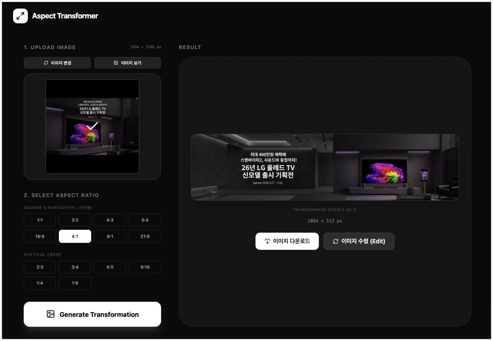

# Aspect Transformer

Aspect Transformer is a web application that allows users to transform the aspect ratio of images using Google's Gemini AI models. It supports both image outpainting (expanding background) and smart repositioning of elements like text and subjects to fit new aspect ratios harmoniously.



## Features
- **Aspect Ratio Transformation**: Convert images to various aspect ratios (1:1, 4:3, 16:9, 21:9, 4:1, 8:1, 3:4, 9:16, 1:4, 1:8).
- **Smart Layout Rules**: Enforces layout rules based on aspect ratio (e.g., bottom-heavy for vertical, right-aligned subject for horizontal).
- **Model Optimization**: Automatically selects between Gemini 3.1 Flash and Gemini 3 Pro based on aspect ratio and task.
- **Error Handling**: Robust retry mechanism for API rate limits (429).

## Run Locally

### Prerequisites
- Node.js (v18+)
- Python (v3.10+)
- Gemini API Key

### 1. Backend Setup
1. Navigate to the `backend` directory:
   ```bash
   cd backend
   ```
2. Create a virtual environment and activate it:
   ```bash
   python -m venv venv
   source venv/bin/activate  # On Windows use `venv\Scripts\activate`
   ```
3. Install dependencies:
   ```bash
   pip install -r requirements.txt
   ```
4. Create a `.env` file and set your API key:
   ```env
   GEMINI_API_KEY="your_api_key_here"
   ```
5. Start the backend server:
   ```bash
   uvicorn main:app --reload --port 8000
   ```

### 2. Frontend Setup
1. Navigate to the `frontend` directory:
   ```bash
   cd frontend
   ```
2. Install dependencies:
   ```bash
   npm install
   ```
3. Start the frontend development server:
   ```bash
   npm run dev
   ```
4. Open your browser and go to `http://localhost:3000`.

## Deployment to Cloud Run

You can deploy this application to Google Cloud Run  It uses a multi-stage Dockerfile to build the frontend and serve it via the FastAPI backend.

### Prerequisites
- Google Cloud SDK (gcloud CLI) installed and authenticated.
- A project selected in gcloud (`gcloud config set project PROJECT_ID`).

### Steps
1. Ensure you are in the project root directory.
2. Run the deployment script:
   ```bash
   gcloud run deploy aspect-transformer \
    --source . \
    --region us-central1 \
    --allow-unauthenticated \
    --set-env-vars GEMINI_API_KEY="your-key"

   ```
3. The script will build the container image and deploy it to Cloud Run.
4. Once completed, it will output the URL where your app is running.
